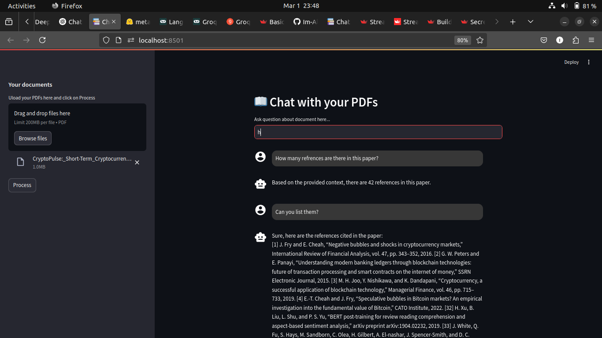
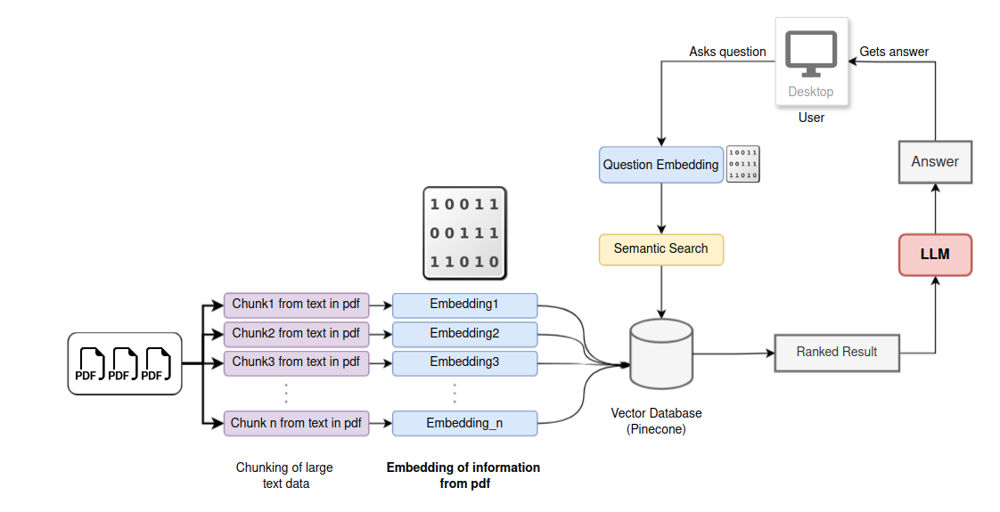

# LangChain_Bot
## Chatbot Interface

Here is a preview of the chatbot interface:




## Setup Instructions

Follow these steps to set up the Streamlit app locally:

1. **Clone the repository:**
    ```bash
    git clone https://github.com/Im-Alam/LangChain_ChatBot.git
    cd LangChain_ChatBot
    ```

2. **Create a virtual environment:**
    ```bash
    python3 -m venv venv
    source venv/bin/activate  # On Windows use `venv\Scripts\activate`
    ```

3. **Install the dependencies:**
    ```bash
    pip install -r requirements.txt
    ```
4. **Setup environment based on sample_env file:**
    ```bash
    touch .env
    ```
5. **Run the Streamlit app:**
    ```bash
    streamlit run app.py
    ```

6. **Open your browser and navigate to:**
    ```
    http://localhost:8501
    ```
## Architecture

